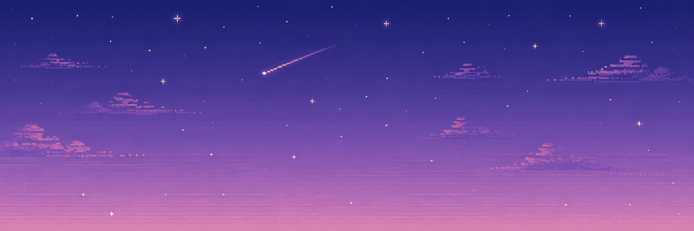

  

<h1 align="center">Hi 👋, I'm Filip Karika</h1>
<h3 align="center">Full-Stack Developer focused on Backend & DevOps</h3>

- 🧠 I’m interested in **AI-powered products, RAG systems, LLM integrations, and MCPs**

- 🔧 I enjoy working with **APIs, databases, authentication, infrastructure, and deployment workflows**

- 🎓 I’m studying at **Unicorn University** and **42 Prague**

- 📚 I try to push myself every day, contribute to software consistently, and keep improving

- 🌱 In the future, I want to start my own startup and experience the full startup journey from the beginning

- 🚀 More information about me: **[sknefi.github.io](https://sknefi.github.io/)**

<h3 align="left">Main Stack:</h3>

<h3 align="left">Daily Tools:</h3>

